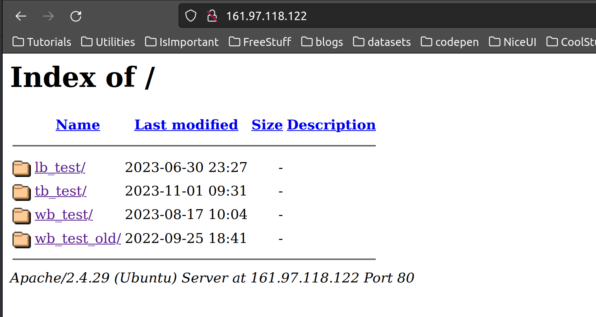

# wocabee-vulnerabilities
Toto je súpis všetkch nájdených chýb v jazykovej aplikácií wocabee, ktoré uľahčujú pridávanie bodov

# wocabee-bot 
[bot](https://github.com/matusbarany04/wocabee-vulnerabilities/blob/master/main_with_flexible_range.py)
Bot je python script fungujúci na selenium automatizovanom web prehliadači, ktorý funguje na princípe, že mu dáme slovník slovíčok, ktoré sa v lekcií nachádzajú a on potom na základe html kódu prečíta slovíčko a vloží text do kolónky so správnou odpoveďou, spolu s animationFadeTime dokáže byť bot dosť rýchly približne jedno slovíčko za sekundu. 


# Hlavný problém
Hlavným bezpečnostným problémom je, že funkcie ktoré by mali byť riešené na backende sú riešené na frontende. 
Používateľovi tak stačí otvoriť vývojárske nástroje prehliadača a vie preložiť slovíčko skôr ako niečo zadá.  
Každá premenná na frontende sa tak dá jednoducho zmeniť ak otvorýme vývojárské nastavenia pridáme za ňu brakepoint a v konzole zmeníme jej hodnotu. 

Tu je niekoľko dôležitých, ktoré sme našli:

# $animationFadeTime

Na urýchlenie času medzi jednotlivými slovíčkami je potrebné pozmeniť premennú $animationFadeTime z 875 na 0, po čom zmiznú všetky animácie,  výrazne sa zrýchli proces prechádzania slovíčok (bot tak dokáže urobiť zhruba 10 000 wocapointov za hodinu). 


# checkStatus
Aplikácia posiela každé 3 sekundy žiadosť s akciou check_status, či náhodou používateľ nemá otvorenú aplikáciu aj na druhej karte alebo nebol odhlásený. Čas je tiež zadefinový v premennej v JS, zmeniť ju je to jeden zo spôsobov ako tieto pravidelné žiadosti zrušiť.


# $spRows
Slovíčko zadávané užívateľovi sú odhalené na frontende a je možná ich úprava, čo má za následok rychlejšie splnenie lekcie, pozretie si odpovedí alebo možnosť pre iných botov načítať slovník rovno zo stránky


# Upravovanie prípočtu bodov
Napriek tomu, že sčítané body sú v závere šifrované, je možné si pripočítať takmer neobmedzený počet bodov, v súbore practise_local.js je blok kódu v ktorom sú zapísané počty bodov normálnymi hodnotami, ktoré sa dajú meniť. 
Stačí teda pod neho pridať brakepoint, prepísať hodnoty a stlačiť "uložiť a odísť". Wocapointy sú následne pripočítané ako keby užívateľ normálne všetko vyklikal - Je otázne či je dobré posielať počet bodov nakonci v POST žiadosti s akciou savePracticePoints.

[function](img/function.png)


# súbor sec.js
domnievame sa, že tento súbor by mal slúžiť na zaistenie či užívateľ nepodvádza, ale keďže je to stále frontend tiež to je možné jednoducho vypnúť.

```js
// security

$( document ).ready(function() {

    func1(); 
    
    setInterval(func1, 500);

    function func1() {
      
        if ($('#hButtons').length)
        {
            logIncident("case_HB","hButtons");
            alert(incidentMsg);
            $('body').remove();
        }
        if ($('#wocaBot').length)
        {
            logIncident("case_WB","wocaBot");
            alert(incidentMsg);
            $('body').remove();
        }

        // sub elements from hButtons
        if ($('#hGrind').length || $('#hAutoFail').length || $('#hAutoFocusButton').length || $('#hTranslateButton').length
            || $('#hLogButton').length || $('#hLogJSONButton').length || $('#hHideButton').length)
        {
            logIncident("case_HB2","todo");
            alert(incidentMsg);
            $('body').remove();
        }
        // sub elements from hButtons
        if ($('.trialDiv').length || $('.articleError').length || $('.preklady').length)
        {
            logIncident("case_AC","todo");
            alert(incidentMsg);
            $('html').remove();
        }


    }
    
...
```
    

# Stránke indexovaná ako IP adresa

(link)[http://161.97.118.122]

Skôr estetická chyba, no apache sa dá nakonfigurovať aby apache presmeroval get na IP adresu na samotnú doménu stránky


# Zle nakonfigurovaný apache server

Apache by nemal odhaľovať priečinkovú štruktúru verejnosti, umožnuje tým ľudom jednoducho prehľadávať podstránky, ktoré by inak bolo možno ťažko uhádnuteľné.





# naše odporúčané kroky

 - Odporúčame prepísať kritické funkcie do PHP a tak predísť meneniu hodnôt v stránke.


 - Navrhujeme, častejšiu komunikáciu so serverom ako taktiež dynamické načítanie jednotlivých úloh spolu s testovaním správnosti odpovedí na backende, tým by sa zamedzila zmena bodov v javascripte, ktorá je poslaná na server  

 - Aj napriek tomu, že po stránke šetrenia siete je jednoduchšie posielať jeden request na konci lekcie, pri webovej stránke to nie je vhodným riešením 

 - Ak chcete predísť používaniu bota uvedeného vyššie, odporúčame vyhodnocovať čas za ktorý je určitý počet slovíčok vyklikaných a pridať captchu ak systém vyhodnotí, že sa jedná o bota.

  Google Recapthcha
  (captcha)[https://www.google.com/recaptcha/about/]


 - Pre staženie práce s automatizačnými botmi by bolo možno vhodné vykresľovať slovíčko ako obrázok, čím by sa sťažilo čítanie úloh   


